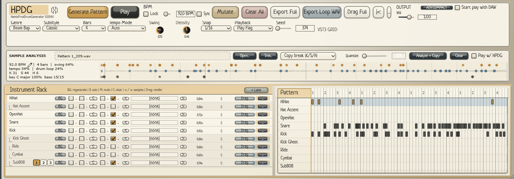
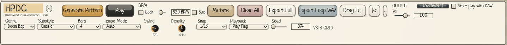
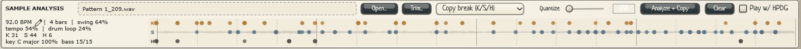
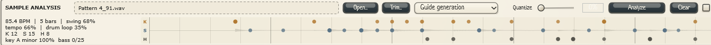
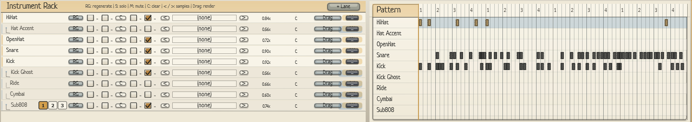

<p align="center">
  
</p>

<h1 align="center">HPDG — HamloProd Drum Generator</h1>

<p align="center">
  VST3 генератор барабанов и баса для бит-мейкеров — 0.1.0 Beta 1.<br>
  Boom Bap · Trap · DnB · Techno
</p>



## Что это

Первая бета для Windows 10/11 x64 поставляется установщиком
`Releases/HPDG_VST3_Setup_0.1.0-beta.1.exe` с полной библиотекой из 749
аудиосемплов. Активация не требуется. Standalone будет подготовлен отдельно.
См. [FAQ](FAQ.md), [права HamloProd](RIGHTS.txt) и [сборку беты](Installer/README.md).

HPDG генерирует барабанные партии и бас в нужном жанре одной кнопкой, даёт сразу их послушать, поправить в сетке и перетащить в DAW как MIDI или WAV. Может опираться на ваш семпл: подстраивается под его темп, тональность и настроение или восстанавливает ритм брейка по результату анализа.

## Основное

### Генерация в один клик

Жанр, подстиль, длина (1–16 тактов), свинг, плотность и сид. **Generate Pattern** собирает новый бит, **Mutate** слегка меняет текущий, **RG** на дорожке перегенерирует только её.



### Работа от семпла

Перетащите луп или семпл в панель **Sample Analysis**. HPDG определит темп, свинг, тональность и удары K / S / H.

- **Guide generation** — бит и бас генерируются под семпл: в его темпе, тональности и настроении.
- **Copy break** — брейк из семпла копируется в дорожки Kick / Snare / HiHat.
- **Trim…** — выбрать нужный кусок длинного файла. ✏️ рядом с BPM — ввести темп вручную.




### Рэк и сетка

Каждая дорожка — свой семпл, громкость, Solo / Mute / Lock и Drag в DAW. Справа сетка, где паттерн можно править вручную.



### Бас для Boom Bap

Дорожка **Sub808** включается галочкой. Кнопки **[1] [2] [3]** задают, сколько баса будет в следующей генерации: немного, больше или «играет всю дорогу». Бас подстраивается под тональность и настроение семпла.


### Экспорт

**Export Full** и **Drag Full** — весь паттерн в MIDI, **Export Loop WAV** — готовый луп в аудио, **Drag** на дорожке — одна партия.

## Сборка (Windows)

Нужны Visual Studio 2022 и CMake 3.22+. JUCE уже лежит в репозитории.

```bat
build_vst.bat
```

Скрипт собирает VST3 и ставит его в `C:\Program Files\Common Files\VST3`. Запускайте его от администратора при закрытой DAW.

## Права

© 2026 Hamec01 (HamloProd). Все права защищены.

Права на оригинальный код и оформление HPDG принадлежат HamloProd.
Права сторонних семплов, библиотек и шрифтов остаются у их правообладателей.
Условия использования беты и уведомления: [RIGHTS.txt](RIGHTS.txt),
[сторонние материалы](docs/THIRD-PARTY-NOTICES.txt).
